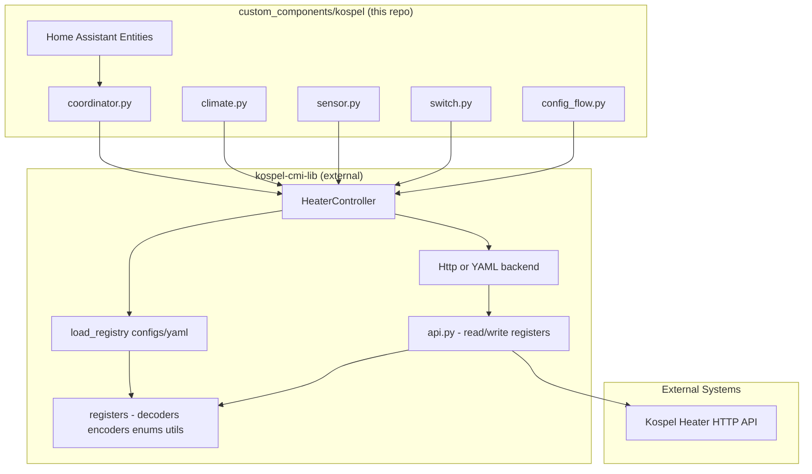

# Architecture

System architecture for the Kospel Heater Home Assistant integration.

```mermaid
graph TB
    subgraph Integration["custom_components/kospel (this repo)"]
        HA[Home Assistant Entities]
        ConfigFlow[config_flow.py]
        Coordinator[coordinator.py]
        SensorEntity[sensor.py]
        ClimateEntity[climate.py]
        SwitchEntity[switch.py]
    end

    subgraph Library["kospel-cmi-lib (external)"]
        HeaterController[HeaterController]
        Backend[Http or YAML backend]
        Registry[load_registry configs/yaml]
        API[api.py - read/write registers]
        Registers[registers - decoders encoders enums utils]
    end

    subgraph External["External Systems"]
        HeaterAPI[Kospel Heater HTTP API]
    end

    HA --> Coordinator
    Coordinator --> HeaterController
    ClimateEntity --> HeaterController
    SensorEntity --> HeaterController
    SwitchEntity --> HeaterController
    ConfigFlow --> HeaterController

    HeaterController --> Backend
    HeaterController --> Registry
    Backend --> API
    Registry --> Registers
    API --> Registers

    API --> HeaterAPI
```
